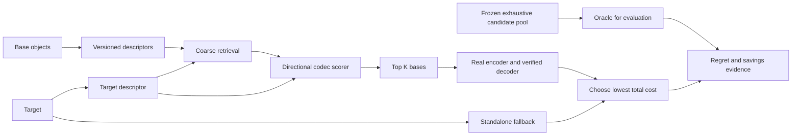

# Charter и решения до реализации

## Формулировка

Delsk исследует `build(bytes) → descriptor` и `rank(base descriptors, target descriptor, codec profile) → top K`. Направление параметров явно задаётся в API. Прогноз предназначен для экономии expensive encodes; корректность обеспечивает фактическое декодирование patch и проверка target.

Ближайший инженерный потребитель — [ChunkShift](https://github.com/definitely-stable/ChunkShift/tree/489d3f2fe2582cc6251ee2fa87cd23bad1793b01), система chunking/manifests/binary updates. Вторичные области: CAS, версии двоичных артефактов, OCI, model checkpoints. Backup и model storage — исследуемые workloads, а не обещание готового продукта для всех сфер.

## Рассмотренные подходы

| Подход | Польза | Цена и решение |
|---|---|---|
| Сразу реализовать DS-1024 из отчёта (6) | Быстрый конкретный prototype | Заранее выбирает размер и features без независимого baseline; отложен |
| Сделать Delsk частью текущего ChunkShift | Можно использовать существующий PatchLab | Смешивает качество выбора разных баз с поиском matches внутри базы; consumer adapter позже |
| Независимая лаборатория: oracle → baselines → ablations | Позволяет отклонить ненужный алгоритм и повторить вывод | Выбран; сначала корпус и измерения, затем минимальная реализация |

## Принятые исследовательские решения

1. **Scope:** descriptor, scorer, простой retrieval adapter, benchmark/evidence. Новый delta codec, CAS, универсальный ANN engine, SecureCDC и собственная модель ML не входят в первую фазу.
2. **Независимость от CDC:** no-CDC и внешний FastCDC — контрольные варианты. ShiftCDC может стать feature source лишь после доказанного дополнительного эффекта. Развивать его Secure/Fast/Stable профили здесь не требуется.
3. **Размеры:** 64/128/256/512 B — основная абляция; 1024 B — контроль информационного потолка из отчёта (6). 4096 B и иерархия нужны только если размер объекта систематически разрушает качество малых sketches. Все размеры учитывают header и счётчики.
4. **Представление отдельно от оценки:** `feature_spec_id`, `descriptor_version`, `scorer_id`, `codec/options_hash`, `index_policy_id` независимы. Integer canonical representation не требует уже сейчас фиксировать integer-only training pipeline.
5. **Начальный стек как рабочий выбор:** stdlib Python для orchestration/analysis и внешние CLI для кодеков; небольшой Rust scalar prototype для features после oracle gate. Rust/C ABI/.NET/WASM packaging решается после качества. Python timings нельзя сравнивать с native throughput как свойство алгоритма.
6. **Детерминизм:** scalar reference, explicit arithmetic/endian/tie rules, streaming partitions, проверка сериализации. SIMD реализуется только после выбора полезных features. ABI и public wire spec не замораживаются заранее.
7. **Все decision runs в GitHub Actions:** стандартные hosted runners; никаких обязательных локальных workstation, self-hosted fleet, GPU или платных larger runners. Результаты скорости ограничены наблюдаемой runner-конфигурацией.
8. **Корректность и безопасность:** descriptor не content identity и не authentication. Неизвестная версия, переполнение, malformed length и несовместимые features отклоняются; postings/кандидаты/память ограничены; отсутствие полезной базы ведёт к standalone fallback.

## Концептуальная схема

Coarse retrieval и reranker измеряются отдельно: хороший scorer не может вернуть базу, уже потерянную retrieval. ANN с несимметричной функцией нельзя считать корректной metric-search конструкцией без проверки; default — exact scan descriptors и затем простой inverted index.

## Что считается успехом

Есть измеримое преимущество перед сильнейшим **воспроизведённым** baseline при равных byte/candidate budgets, контрольных доменах и независимых lineage splits. Если современные методы не воспроизведены, вывод ограничивается реально сравненными методами. Термины «SOTA», «первый» и «универсальный» требуют отдельной claim matrix и evidence.

Первый результат программы может быть benchmark dataset/protocol, полезная эвристика внутри ChunkShift либо отрицательный результат. Отдельная библиотека оправдана только устойчивым Pareto advantage. Наличие публичной статьи, permissive source license или abandoned patent entry не является заключением об отсутствии патентных ограничений; здесь ведётся техническая карта prior art, без юридического verdict.
